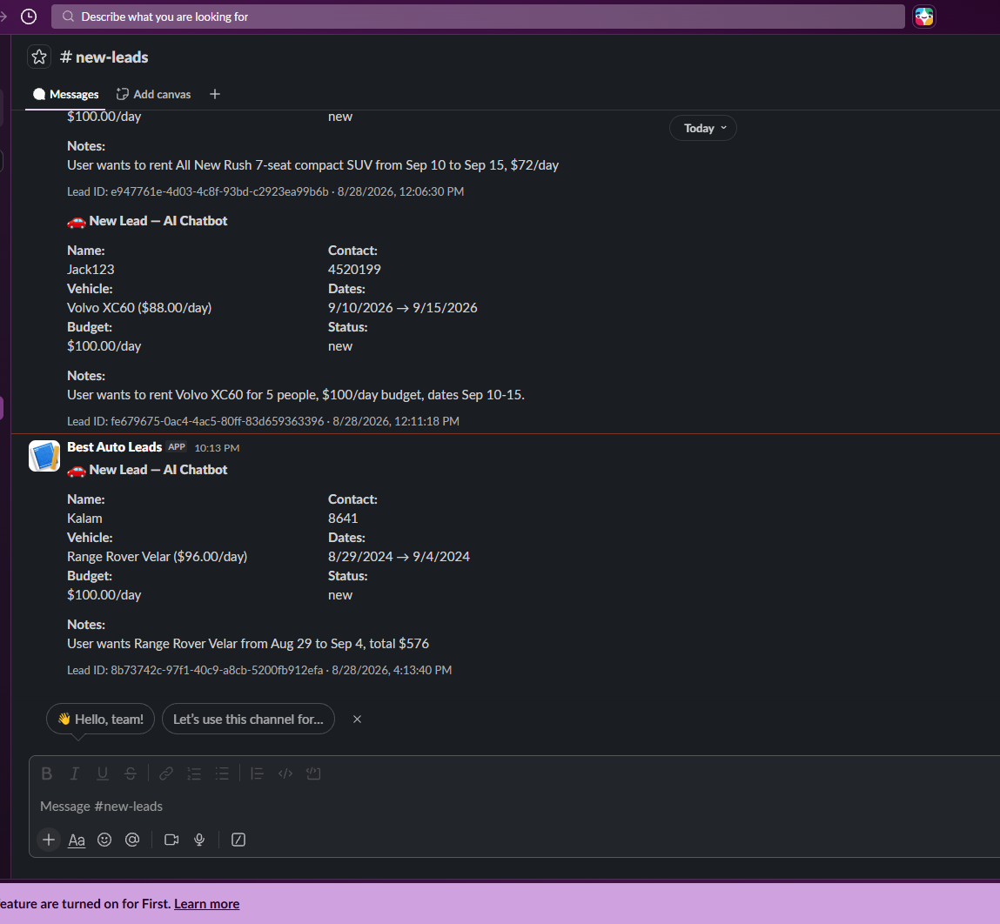

# Best Car — Car Rental Platform with AI Assistant

A car rental admin dashboard + customer-facing website, built with a functional AI chatbot/assistant that recommends real vehicles, checks live availability, and qualifies leads — with automated Slack notifications when a new lead comes in.

---

## Table of Contents

- [Tech Stack](#tech-stack)
- [Features](#features)
- [Architecture Overview](#architecture-overview)
- [Database Design](#database-design)
- [AI Assistant — How It Works](#ai-assistant--how-it-works)
- [Example Conversation](#example-conversation)
- [Automation Workflow](#automation-workflow)
- [LLM Monitoring (LangSmith)](#llm-monitoring-langsmith)
- [Project Setup](#project-setup)
- [Environment Variables](#environment-variables)
- [Available Scripts](#available-scripts)
- [Known Limitations](#known-limitations)

---

## Tech Stack

| Layer                | Technology                                      |
| -------------------- | ----------------------------------------------- |
| Framework            | Next.js (App Router, Server Components)         |
| Database             | Neon Postgres (serverless)                      |
| ORM                  | Drizzle ORM                                     |
| AI / Agent framework | LangChain (JS)                                  |
| LLM provider         | Groq (free tier) — model: `openai/gpt-oss-120b` |
| LLM observability    | LangSmith                                       |
| Automation           | Slack Incoming Webhooks                         |
| Charts (dashboard)   | Recharts                                        |
| Animation            | Framer Motion                                   |
| Validation           | Zod                                             |
| HTTP client          | Axios                                           |

---

## Features

### Admin Dashboard

- Recreated from the provided Figma design.
- Dynamic stats, charts, and tables powered by real seeded data — nothing hardcoded.
- **Leads page**: every lead the AI assistant creates during a conversation shows up here automatically (see [Automation Workflow](#automation-workflow)).
- Responsive on mobile.

### Customer Front-End

- Vehicle browsing, search/filter interface, and rental flow built from the provided wireframe.
- Responsive across desktop, tablet, and mobile.
- Floating AI chat widget available on every customer-facing page.

### AI Chatbot / Assistant

One agent that covers three of the assessment's listed AI feature options at once:

- **AI chatbot/assistant** — conversational interface for the rental site.
- **AI vehicle recommendation** — recommends real vehicles from the database based on stated needs (seats, budget, transmission, fuel type).
- **AI lead qualification** — recognizes when it has enough information (name + contact method) and saves a qualified lead automatically, mid-conversation, without a separate form.

### Automation

- New lead created by the assistant → Slack notification fired to a dedicated `#new-leads` channel via an Incoming Webhook → lead also appears live in the Admin Dashboard's Leads page (same database row, no separate sync needed).

---

## Architecture Overview

```
Customer Front-End (Next.js)
        │
        ├── Chat Widget (React, sessionStorage for conversation history)
        │         │
        │         ▼
        │   POST /api/chat  ──────────────►  LangChain Agent (agent.js)
        │                                          │
        │                                          ├── search_vehicles   (tool → Drizzle query)
        │                                          ├── check_availability (tool → Drizzle query)
        │                                          └── qualify_lead       (tool → Drizzle insert)
        │                                                     │
        │                                                     ├──► Neon Postgres (leads table)
        │                                                     └──► Slack Webhook (notify.js)
        │
Admin Dashboard (Next.js, Server Components)
        │
        └── Reads directly from Neon Postgres (vehicles, bookings, leads, transactions, ...)
```

The chatbot never talks to the dashboard directly — both simply read/write the same Postgres database. A lead created by the AI in a customer's chat session is immediately visible in the Admin Dashboard's Leads page because they share one source of truth.

---

## Database Design

Built with Drizzle ORM against Neon Postgres. Key tables:

| Table                                   | Purpose                                                                                                                                                                                                                                     |
| --------------------------------------- | ------------------------------------------------------------------------------------------------------------------------------------------------------------------------------------------------------------------------------------------- |
| `vehicles`                              | The fleet — pricing, seats, transmission, fuel type, features (jsonb), status (`available` / `maintenance` / `retired`)                                                                                                                     |
| `bookings`                              | The actual availability calendar — date ranges + status (`reserved` / `confirmed` / `completed` / `cancelled`). This is what `check_availability` queries against to detect date conflicts.                                                 |
| `leads`                                 | Where the AI assistant writes. Captures name, contact info, vehicle interest, desired dates, budget, and an AI-generated summary (`notes`). Has a `source` field (defaults to `"chatbot"`) so leads can be traced back to how they came in. |
| `brands`, `categories`, `subCategories` | Vehicle taxonomy used for filtering/search.                                                                                                                                                                                                 |
| `locations`                             | Pickup/dropoff branches.                                                                                                                                                                                                                    |
| `transactions`                          | Sales/purchase records, used to power dashboard revenue charts.                                                                                                                                                                             |
| `users`                                 | Seeded customer records (mock data — this project doesn't implement real user auth/accounts, per the assessment's "mock API" scope).                                                                                                        |

**Design notes:**

- `bookings` is intentionally separate from `transactions` — bookings represent the calendar/availability truth, transactions represent the money truth. This mirrors how a real rental system separates "is this car free on these dates" from "was this car paid for."
- All data is seeded (see [Available Scripts](#available-scripts)) — this is a take-home assessment project, so there's no real user signup/booking flow. The one genuinely "live" write path in the whole system is the AI assistant creating a `leads` row.

---

## AI Assistant — How It Works

Built as a LangChain **tool-calling agent** running on Groq's free-tier `openai/gpt-oss-120b` model. The agent has three tools, all backed by real Drizzle queries against the Neon database — it never guesses or hallucinates vehicle data.

### The three tools

**1. `search_vehicles`**
Filters the real fleet by category, transmission, fuel type, minimum seats, max daily price, and optional date range (excluding vehicles with a conflicting booking). Returns up to 6 real matches with actual prices and features.

**2. `check_availability`**
Given a specific vehicle (by name or ID) and a date range, checks the `bookings` table for date conflicts and returns whether it's actually free, plus the estimated total price for that date range.

**3. `qualify_lead`**
Once the agent has collected a name and at least one contact method (phone or email), this saves a `leads` row with whatever context was gathered during the conversation (vehicle interest, desired dates, budget, and a short AI-written summary). This is what triggers the Slack notification.

### Grounding — why it doesn't hallucinate

The system prompt is explicit: the assistant may only state facts that came back from a tool call. If `search_vehicles` returns nothing, it says so and asks the user to adjust their criteria — it never invents a vehicle to make the conversation flow more smoothly. This was deliberately tested during development (asking for combinations the seeded fleet genuinely can't satisfy) and confirmed working correctly.

### Conversation state

Chat history is kept client-side in the browser's `sessionStorage` — no server-side chat session table. Each request to `/api/chat` sends the recent conversation history, the agent processes it fresh, and returns an updated history the client re-saves. This matches the assessment's "mock API" scope: no real user accounts or persistent server-side sessions, just a stateless request/response chat API.

---

## Example Conversation

This is a real conversation captured during testing, showing the full path from inquiry to a saved, notified lead:

> **User:** I want to rent a car for 5 people around $100/day
>
> **Assistant:** _(calls `search_vehicles`)_ Here are a few options that fit a $100/day budget and seat at least five people: All New Rush – 7-seat compact SUV, $72/day, automatic, petrol. Volvo XC60 – 7-seat family SUV, $88/day, automatic, diesel. Range Rover Velar – 5-seat premium SUV, $96/day, automatic, hybrid. Which one catches your eye, and what dates are you looking to rent it?
>
> **User:** All New Rush
>
> **Assistant:** Great choice! Could you let me know the start and end dates you'd like to rent the All New Rush?
>
> **User:** September 10 to September 15
>
> **Assistant:** _(calls `check_availability`)_ The All New Rush is available from Sept 10 to Sept 15, and the total comes to $360. Could you share your name and a phone number or email so I can lock this reservation for you?
>
> **User:** My name is Easin, email easin@gmail.com, phone 555-0199
>
> **Assistant:** _(calls `qualify_lead`)_ Thanks Easin — I've saved your request for the All New Rush (Sept 10–15). Our team will follow up shortly to confirm everything.

At the moment `qualify_lead` runs:

1. A new row is inserted into the `leads` table in Postgres.
2. That lead **immediately appears in the Admin Dashboard's Leads page** — no separate sync step, since the dashboard reads from the same database.
3. A formatted message is posted to the `#new-leads` Slack channel via webhook (see below).



---

## Automation Workflow

```
qualify_lead tool runs
        │
        ├──► INSERT INTO leads (Postgres)  ─────► visible immediately in Admin Dashboard → Leads page
        │
        └──► notifyLeadCreated(lead)
                    │
                    ▼
             Slack Incoming Webhook
                    │
                    ▼
          #new-leads channel receives a
          formatted message: name, contact,
          vehicle, dates, budget, notes
```

The Slack notification is fire-and-forget and wrapped in its own try/catch — if Slack is down or misconfigured, the lead is still saved successfully; the notification failure is logged server-side but never blocks the actual lead capture.

---

## LLM Monitoring (LangSmith)

This project uses **LangSmith** for LLM observability during development — every agent run (each model call and each tool call within it) is traced, which made it possible to debug exactly which tool was being called, with what arguments, and why, when the agent's behavior needed tuning. LangSmith tracing is optional and controlled entirely by environment variables (see below) — the app runs fine without it, you just lose the trace visibility.

---

## Project Setup

### 1. Clone and install

```bash
git clone https://github.com/EasinTanvir/Digital-Pylot
cd Digital-Pylot
npm install
```

### 2. Set up environment variables

Copy `.env.example` to `.env` and fill in the values (see [Environment Variables](#environment-variables) below for where to get each one).

```bash
cp .env.example .env
```

### 3. Set up the database

```bash
npm run db:generate   # generate Drizzle migration files from the schema
npm run db:migrate    # apply migrations to your Neon database
npm run db:seed       # populate the database with mock vehicles, brands, bookings, leads, etc.
```

### 4. Run the dev server

```bash
npm run dev
```

The app will be running at `http://localhost:3000`. The customer front-end is the main site; the admin dashboard is under `/dashboard`.

### 5. Try the AI assistant

Open the chat widget (bottom-right corner on any customer-facing page, not shown on `/dashboard` routes) and try:

- _"I need something for 5 people around $100/day"_
- _"Is the Volvo XC60 available from Sept 10 to Sept 15?"_
- _"What documents do I need to rent a car?"_

---

## Environment Variables

Create a `.env` file with the following:

```dotenv
# Required — Neon Postgres connection string
DATABASE_URL=

# Required — Groq API key (free tier), used by the AI assistant
GROQ_API_KEY=

# Required for the automation workflow — Slack Incoming Webhook URL
SLACK_WEBHOOK_URL=

# Optional — LangSmith tracing, for LLM observability during development
LANGSMITH_TRACING=
LANGSMITH_ENDPOINT=
LANGSMITH_API_KEY=
LANGSMITH_PROJECT=
```

**Where to get each one:**

- `DATABASE_URL` — from your Neon project dashboard (Connection Details).
- `GROQ_API_KEY` — free at [console.groq.com](https://console.groq.com), no credit card required.
- `SLACK_WEBHOOK_URL` — create a Slack app at [api.slack.com/apps](https://api.slack.com/apps) → **Incoming Webhooks** → activate → add to your desired channel → copy the generated URL.
- `LANGSMITH_*` — optional, from [smith.langchain.com](https://smith.langchain.com) if you want to view agent traces. The app works fine without these set.

> **Important note on the Groq free tier:** this project intentionally runs on Groq's free API tier, which has a fairly tight rate limit (tokens-per-minute, not just requests-per-minute). If the AI assistant returns an error like _"I'm getting a lot of requests right now"_ or a 429 in the server logs, that's the free-tier rate limit being hit — not a bug in the app. To reduce how often this happens, the agent already trims conversation history to the last few exchanges before each request (rather than sending the full growing conversation every time), which keeps token usage roughly flat as a chat gets longer. If you hit this limit while testing, just wait ~15–20 seconds between messages, or swap in your own paid Groq key / a different model in `lib/ai/llm.js`.

---

## Available Scripts

```json
"dev": "next dev",              // start the dev server
"build": "next build",          // production build
"start": "next start",          // run the production build
"lint": "eslint",               // lint the codebase
"db:generate": "drizzle-kit generate",  // generate migration files from the Drizzle schema
"db:migrate": "drizzle-kit migrate",    // apply migrations to the database
"db:seed": "node db/seed/index.js"      // populate the database with mock data
```

### Key dependencies

| Package                         | Role                                          |
| ------------------------------- | --------------------------------------------- |
| `next`                          | App framework (Server Components, API routes) |
| `react` / `react-dom`           | UI                                            |
| `drizzle-orm` / `drizzle-kit`   | Database schema, migrations, queries          |
| `@neondatabase/serverless`      | Neon Postgres driver                          |
| `langchain` / `@langchain/core` | Agent framework and tool-calling              |
| `@langchain/groq`               | Groq LLM integration for LangChain            |
| `zod`                           | Schema validation for tool arguments          |
| `axios`                         | HTTP client (chat widget → API)               |
| `recharts`                      | Dashboard charts                              |
| `framer-motion`                 | UI animation                                  |
| `react-icons`                   | Icon set                                      |

---

## Known Limitations

- This is a mock-data project per the assessment's requirements — there's no real user authentication, no real payment processing, and "Book Now" on the customer site does not create a real reservation. The one genuinely live write path in the entire system is the AI assistant's `qualify_lead` tool.
- The AI assistant runs on Groq's free tier, which has real rate limits (see the note above). For a production deployment, this would move to a paid tier or a higher-throughput model.
- FAQ/policy answers are served from a small in-code list matched by keyword, not a full RAG/vector search pipeline — intentional, given the scope of a small FAQ set for this assessment.
